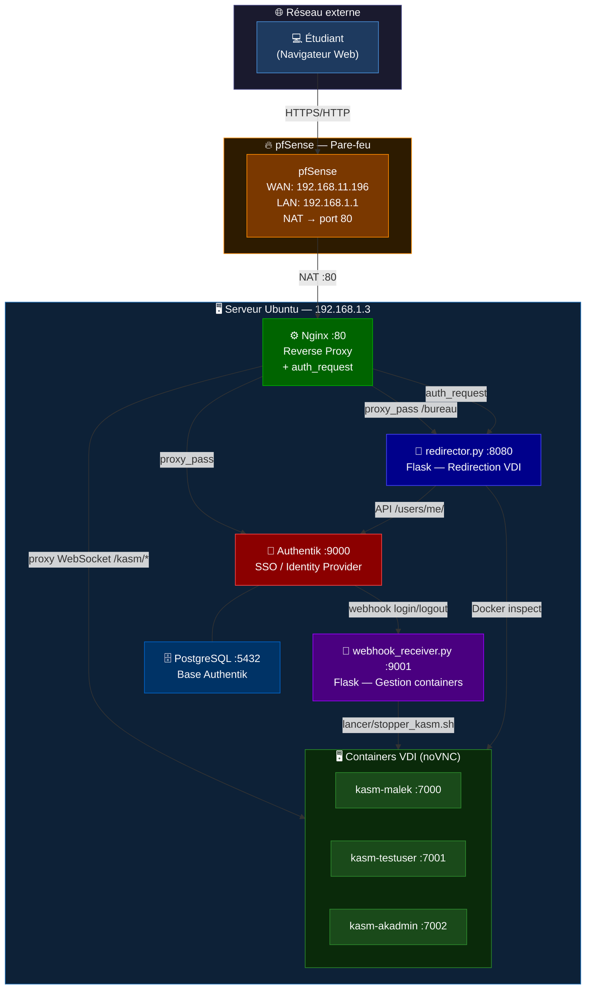
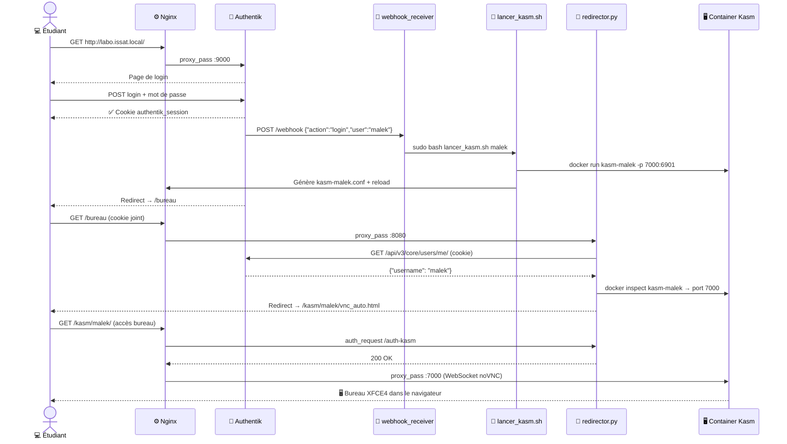
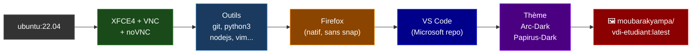

# Infrastructure VDI — ISSAT

<div align="center">


**Infrastructure VDI (Virtual Desktop Infrastructure) permettant à chaque étudiant d'accéder depuis son navigateur à un bureau Linux complet, isolé et sécurisé.**

</div>

---

## Architecture générale



---

## Flux d'authentification et de démarrage



---

## Stack technique

| Composant | Rôle | Adresse |
|---|---|---|
| **pfSense** | Pare-feu, NAT, routage réseau | WAN `192.168.11.196` / LAN `192.168.1.1` |
| **Nginx** | Reverse proxy + contrôle d'accès (`auth_request`) | `:80` |
| **Authentik** | SSO, gestion des sessions, webhooks | `:9000` / `:9443` |
| **redirector.py** | Redirection vers le bureau + vérification d'accès | `:8080` |
| **webhook_receiver.py** | Démarrage/arrêt automatique des containers | `:9001` |
| **Containers Kasm** | Bureau Linux XFCE4 par étudiant via noVNC | `:7000–8000` |
| **PostgreSQL** | Base de données Authentik | `:5432` (interne) |

---

## Structure du dépôt

```
issat-vdi-infrastructure/
│
├── README.md                          ← Ce fichier
│
├── docker/                            ← Image Docker du bureau étudiant
│   ├── Dockerfile                     ← Construction Ubuntu 22.04 + XFCE4
│   ├── docker-compose.yml             ← Déploiement local
│   ├── scripts/
│   │   ├── startup.sh                 ← Point d'entrée du container
│   │   ├── supervisord.conf           ← Supervision Xvfb, XFCE4, x11vnc, noVNC
│   │   └── entrypoint.sh             ← Entrypoint alternatif (LXDE)
│   ├── config/
│   │   └── set-wallpaper.sh          ← Application du fond d'écran XFCE4
│   └── src/install/
│       ├── tools/install_tools.sh    ← Paquets système (XFCE4, VNC, outils)
│       ├── firefox/install_firefox.sh ← Firefox natif (sans snap)
│       ├── vscode/install_vscode.sh  ← Visual Studio Code
│       ├── desktop/setup_desktop.sh  ← Raccourcis + thème Arc-Dark
│       └── cleanup/cleanup.sh        ← Nettoyage post-installation
│
├── authentik/
│   └── docker-compose.yml            ← Stack Authentik (server + worker + postgres + redis)
│
├── scripts/
│   ├── lancer_kasm.sh                ← Démarre un bureau VDI pour un étudiant
│   ├── stopper_kasm.sh               ← Arrête un bureau VDI et libère les ressources
│   ├── fix_nginx_configs.sh          ← Récupération d'urgence des configs Nginx
│   └── build-push.sh                 ← Build et push de l'image sur Docker Hub
│
├── flask/
│   ├── redirector.py                 ← Redirecteur Flask :8080 + auth_request
│   └── webhook_receiver.py           ← Récepteur webhooks Authentik :9001
│
└── rapport_infrastructure_issat.md   ← Documentation technique complète
```

---

## Image Docker — Bureau étudiant

L'image `moubarakyampa/vdi-etudiant` est construite depuis Ubuntu 22.04 avec :



**Applications disponibles dans le bureau :**
- Firefox, Visual Studio Code, Terminal XFCE4
- GIMP, VLC, Thunderbird
- Gestionnaire de fichiers Thunar
- `git`, `python3`, `nodejs`, `npm`, `vim`, `nano`, `htop`, `curl`

**Ordre de démarrage supervisord :**

```
Xvfb :1 (1920×1080)
    └─► XFCE4 + x11vnc (attendent Xvfb)
            └─► noVNC :6901 (attend le port VNC 5900)
                    └─► disable-screensaver (après 20s)
```

### Construire et déployer l'image

```bash
cd docker/

# Construire l'image localement
docker build -t moubarakyampa/vdi-etudiant:latest .

# Tester en local (accès : http://localhost:6901)
docker run -d -p 6901:6901 --shm-size=512m moubarakyampa/vdi-etudiant:latest

# Publier sur Docker Hub
./build-push.sh <ton-username-dockerhub>
```

---

## Déploiement de l'infrastructure

### 1. Démarrer Authentik

```bash
cd authentik/
cp .env.example .env          # Remplir PG_PASS et AUTHENTIK_SECRET_KEY
docker compose up -d
# Interface disponible : http://192.168.1.3:9000/
```

### 2. Configurer Nginx

```bash
# Copier les virtual hosts
sudo cp nginx/sites-available/* /etc/nginx/sites-available/
sudo ln -s /etc/nginx/sites-available/laboissat /etc/nginx/sites-enabled/

# Créer le dossier des configs dynamiques
sudo mkdir -p /etc/nginx/kasm-locations

sudo nginx -t && sudo systemctl reload nginx
```

### 3. Démarrer les services Flask

```bash
# Installer les dépendances
pip install flask requests docker

# Démarrage manuel
python3 flask/redirector.py &          # Port 8080
python3 flask/webhook_receiver.py &    # Port 9001

# Démarrage automatique via systemd (recommandé)
sudo cp systemd/*.service /etc/systemd/system/
sudo systemctl enable --now redirector webhook-receiver
```

### 4. Gérer les bureaux étudiants

```bash
# Démarrer un bureau
sudo bash scripts/lancer_kasm.sh <nom_etudiant>

# Arrêter un bureau
sudo bash scripts/stopper_kasm.sh <nom_etudiant>

# Après un reboot : régénérer toutes les configs Nginx
sudo bash scripts/fix_nginx_configs.sh

# Vérifier l'état des bureaux actifs
curl http://localhost:8080/status
```

---

## Sudoers nécessaires

Pour que les services Flask puissent exécuter les scripts :

```bash
# /etc/sudoers.d/kasm-vdi
www-data ALL=(ALL) NOPASSWD: /home/docker/authentik/lancer_kasm.sh
www-data ALL=(ALL) NOPASSWD: /home/docker/authentik/stopper_kasm.sh
www-data ALL=(ALL) NOPASSWD: /home/docker/authentik/fix_nginx_configs.sh
www-data ALL=(ALL) NOPASSWD: /usr/sbin/nginx
www-data ALL=(ALL) NOPASSWD: /bin/systemctl reload nginx
www-data ALL=(ALL) NOPASSWD: /bin/rm /etc/nginx/kasm-locations/*
```

---

## Points d'attention sécurité

| Priorité | Problème | Recommandation |
|---|---|---|
| 🔴 **HAUTE** | Pas de HTTPS | Configurer Certbot / Let's Encrypt sur `labo.issat.local` |
| 🔴 **HAUTE** | Ports 7000–8000 exposés via pfSense | Supprimer ces règles NAT — tout doit passer par Nginx :80 |
| 🟡 **MOYENNE** | TLSv1 / TLSv1.1 activés dans Nginx | Désactiver : `ssl_protocols TLSv1.2 TLSv1.3;` |
| 🟡 **MOYENNE** | Worker Authentik monte `/var/run/docker.sock` | Accès total au daemon Docker — limiter si possible |
| 🟠 **FAIBLE** | `server_tokens` actif dans Nginx | Ajouter `server_tokens off;` dans `nginx.conf` |

---

## Informations serveur

| | |
|---|---|
| **OS** | Ubuntu Linux — kernel 6.8.0-106-generic |
| **RAM** | 21 Go total / ~17 Go disponibles |
| **Disque** | 95 Go (utilisé à 66%) |
| **Capacité** | ~15 bureaux simultanés (1 Go RAM/étudiant) |
| **Réseau LAN** | 192.168.1.3/24 (ens18) |
| **Docker** | 172.17.0.0/16 (Kasm) / 172.18.0.0/16 (Authentik) |

---

<div align="center">

Projet Infrastructure VDI — ISSAT | 2026

</div>
